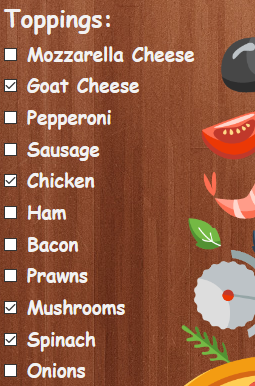
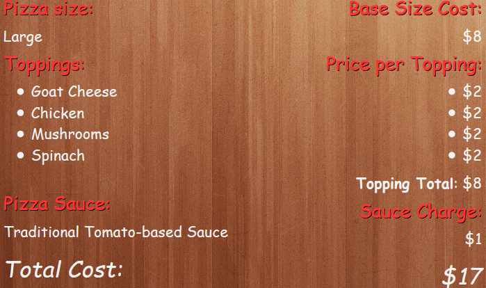

# _Pizza Parlor_

#### _Week 4 Independent Friday Project for Epicodus, 01.31.2020_

#### By _**Tiffany Siu**_

## Description

<!-- _Detailed desc w/ purpose/usage, what does, motivation to create, why exists, other info for users/developers to have_ -->

## Setup/Installation Requirements

### Requirements to Run
* _Web Browser_

### Other Resources Used
* _JQuery_
* _Bootstrap_

### Instructions
_This page may be viewed by cloning the [repository](https://github.com/TSiu88/pizza-parlor.git) from my [GitHub page](https://github.com/TSiu88) and opening the **index.html** file in any web browser._

## Technologies Used

* _HTML_
* _CSS_
* _Javascript_
* _JQuery_
* _Bootstrap_
* _Markdown_

## Notable Features
<!-- _features that make project stand out_ -->

## Specifications

* _The program has a home page with info on the pizza parlor and an "Order a Pizza" button_
  * _Example Input: page is loaded_
  * _Example Output: hide all displays except initial home display with button to "Order a Pizza"_
* _The program switches the display to show cost of the order when user clicks "Show cost"_
  * _Example Input: click "Show cost"_
  * _Example Output: hide ordering display, show cost display with selections_
* _The program switches the display to order confirmed when user clicks "Confirm order"_
  * _Example Input: click "Confirm order"_
  * _Example Output: hide cost display, show order confirmed display with return to home button_
* _The program has a return to home button after order confirmed to return back to initial home page_
  * _Example Input: click "Return to Home"_
  * _Example Output: hide all displays except initial home display with button to "Order a Pizza"_
* _The program creates a pizza order when the user clicks "Order a Pizza"_
  * _Example Input: click "Order a Pizza"_
  * _Example Output: new order for a pizza is given with order screen shown, hide order button and home page info_
* _The program has a drop down menu with pizza sizes to choose from_
  * _Example Input: pick "Large"_
  * _Example Output: store selection "Large" into pizza object_
* _The program has checkboxes to select one or more toppings._
  * _Example Input: check "cheese, pepperoni, mushrooms"_
  * _Example Output: store selections "cheese", "pepperoni", and "mushrooms" into array of chosen toppings_
* _The program has a radio button choice of what sauce to use for the pizza_
  * _Example Input: pick "garlic parmesan white sauce"_
  * _Example Output: store selection "garlic parmesan white sauce" into pizza object_
* _The program uses size selection stored in a pizza object to calculate the cost of that pizza_
  * _Example Input: click "Show cost" with selection "Large"_
  * _Example Output: return base cost for "Large" pizzas of $8_
* _The program uses topping selections stored in a pizza object to calculate the cost of that pizza_
  * _Example Input: click "Show cost" with selections "chicken, spinach, mushrooms"_
  * _Example Output: return additional cost of $2 per topping, $6 in this case_
* _The program uses sauce selection stored in a pizza object to calculate the cost of that pizza_
  * _Example Input: click "Show cost" with selections "Large", "chicken, spinach, mushrooms", "garlic parmesan white sauce"_
  * _Example Output: return additional cost of $1 for white sauce, no additional cost for traditional tomato sauce_
* _The program uses all selections stored in a pizza object to calculate the cost of that pizza_
  * _Example Input: click "Show cost" with selections "Large", "chicken, spinach, mushrooms", "garlic parmesan white sauce"_
  * _Example Output: return $15 total cost with itemized cost of each category of selections_

## Screenshots

<!-- _Here is a snippet of what the input looks like:_

_Here is a preview of what the output looks like:_

 -->

<!-- _{Show pictures using , show what library does as concisely as possible but don't need to explain how project solves problem from `code`_ -->

## Test Case Example
<!-- _describe and show how to run tests with `code` examples}_ -->

## Known Bugs

_There are currently no known bugs in this program_

## Support and contact details

_If there are any question or concerns please contact me at my [email](mailto:tsiu88@gmail.com). Thank you._

### License

*This software is licensed under the MIT license*

Copyright (c) 2020 **_Tiffany Siu_**
